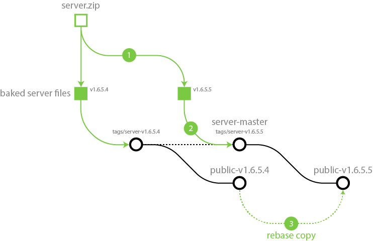

> Server baking utility for the PR:BF2 server.

This utility project helps preparing versions of the PRBF2 server by pre-applying the updates from `prserverupdater`, and then running some extra cleanup to get rid of unnecessary files.

<details>
<summary>A diagram of the server baking workflow</summary>

> Note: This diagram is kinda outdated already, but it's probably still helpful so it stays for now.
> For the real tagging and branch naming scheme, refer to the documentation of the [server](https://gitlab.com/prboomers/server#readme) repository.


</details>

## Baking a new version

### Setting up to run `prserverupdater`

To create a  baked server version, you will need the base server zip provided by the developers. You can download the server license zip from the [licence control panel](https://www.realitymod.com/forum/licensecp.php?do=downloads) on [realitymod.com](https://www.realitymod.com).

> I recommend that you place this file into the baker folder, but you can put it anywhere you want.

Next, `prserverupdater` requires a `license.key` and a server configuration `serversettings.con` file to work with when updating the server.
If you happen to have an already running server you can just copy these files from the server folder.
Otherwise, you will have to create these files yourself.

```sh
# Create the license file from your key
# see: https://www.realitymod.com/forum/licensecp.php?do=info
> printf "MY-SERVER-LICENSE-KEY" > ./baking/license.key

# Create a rudimentary server settings file with your server IP and port
# see: https://www.realitymod.com/forum/licensecp.php?do=servers
> printf "sv.serverIP \"127.0.0.1\"\nsv.serverPort 1337\n" > ./baking/serversettings.con
```

### Baking a server version

Once everything is set up, you can then run the bake command, which will
- unzip the server into a temporary folder,
- run `prserverupdater`
- and finally, strip out any unnecessary `.exe` and `.dll` files.

```sh
# Running the bake command
> ./bake prbf2_1.6.3.0_server.zip
```

The resulting server files reside in `bakes/<starting_zip_name>_baked`.
Normally this folder is then copied to replace the server folder of the [server](https://gitlab.com/prboomers/server#readme) repository, and committed as a new base version.

### Cleaning up bakes

If you no longer need the baked files, or you want to clean up after a failed bake, run `./baking/clean`.
```sh
# Deleting all bakes
> ./clean
```
**Beware, this will indiscriminately remove everything in `./bakes`!**
